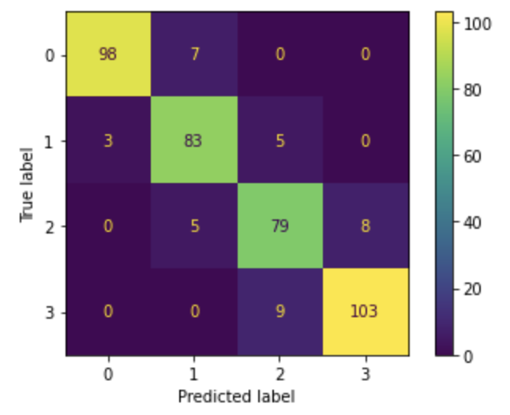
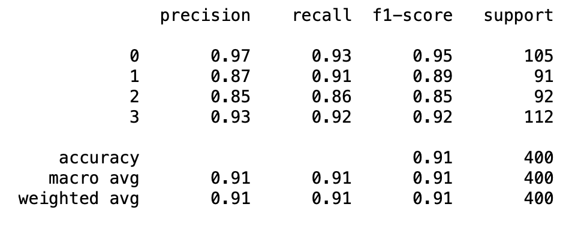

# Phone Price Predictor: Project Overview 
* Objective 
This project aims to build an optimal machine learning model to predict a phone's price range given the phone's features. 

* Walkthrough
  - Define the question and collect the data
  - Exploratory Data Analysis
  - Data Cleaning 
  - Fit Machine Learning Models & Compare their performances 
  - Hyperparameter Tuning for Final Machine Learning Model

* Data & Coding Language Used 
  - Data: 
  - Python Version: 3.9
  - Packages : numpy, pandas, matplotlib, seaborn, sklearn
  
### Exploratory Data Analysis 
* The counts of each categorical feature were checked 
(includes a plot that was stratified by the outcome feature and a plot that was not stratified)  
&#8594; It can be seen that among the phones that have either bluetooth, dual sim, 4G, or wifi, the phones in the highest price range are the most common

* The distribution of each numerical feature was checked as well 
(includes a plot that was stratified by the outcome feature and a plot that was not stratified) 
&#8594; Battery power, pixel resolution width, and ram each seems to have a clear association with phone price range

  

* Battery power, pixel resolution width, and ram indeed showed the strongest correlation coefficients with phone price range 

### Data Cleaning & Feature Engineering
* Data were scaled 
* Skewed features underwent log transformation 
* Heavily correlated features were handled: features that were very redundant and less important were dropped
* There were no missing or duplicated values 
* One-hot encoding was done for the categorical variables 
* Data had balanced outcome classes  

### Fit Machine Learning Models & Compare their Performances 
* The data were split into train and test sets with a test size of 20%
* Four models(KNN, SVM, Naive Bayes, Random Forest) were trained with default parameters 
* Each model's accuracy was compared: Random Forest and SVM showed the highest accuracies 

### Hyperparameter Tuning for Final Machine Learning Model 
* The hyperparameters of Random Forest and SVM were tuned, which increased both models' accuracies
* SVM was selected as the final model because its accuracy was higher
* The accuracy, precision, and recall of the final model were checked with test data (accuracy = 0.91) 
 
