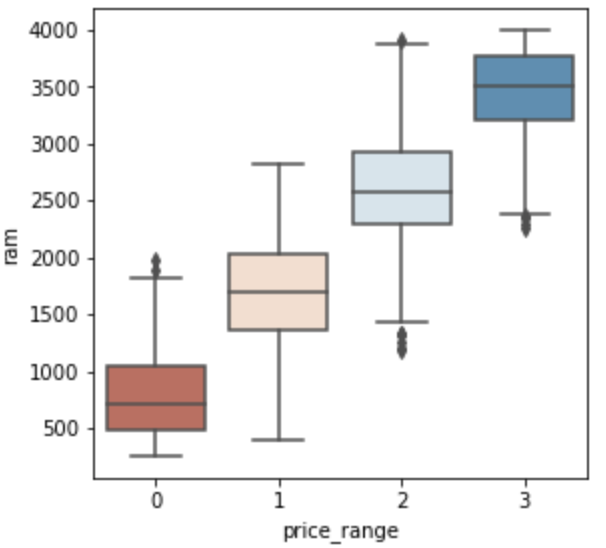

# Phone Price Predictor: Project Overview 
* Objective 
This project aims to build an optimal machine learning model to predict a phone's price range given the phone's features. 

* Walkthrough
  - Define the question and collect the data
  - Exploratory Data Analysis
  - Data Cleaning 
  - Fit Machine Learning Models & Compare their performances 
  - Hyperparameter Tuning for Final Machine Learning Model

* Data & Coding Language Used 
  - Data: 
  - Python Version: 3.9
  - Packages : numpy, pandas, matplotlib, seaborn, sklearn
  
### Exploratory Data Analysis 
* The counts of each categorical feature were checked 
(includes a plot that was stratified by the outcome feature and a plot that was not stratified)  
&#8594; It can be seen that among the phones that have either bluetooth, dual sim, 4G, or wifi, the phones in the highest price range are the most common

* The distribution of each numerical feature was checked as well 
(includes a plot that was stratified by the outcome feature and a plot that was not stratified) 
&#8594; Battery power, pixel resolution width, and ram each seems to have a clear association with phone price range

  

* Battery power, pixel resolution width, and ram indeed showed the strongest correlation coefficients with phone price range 

### Data Cleaning & Feature Engineering
* Data were scaled 
* Skewed features underwent log transformation 
* Heavily correlated features were handled: 
* There were no missing or duplicated values 
* Outcome classes were balanced 

### Fit Machine Learning Models & Compare their Performances 

### Hyperparameter Tuning for Final Machine Learning Model 

